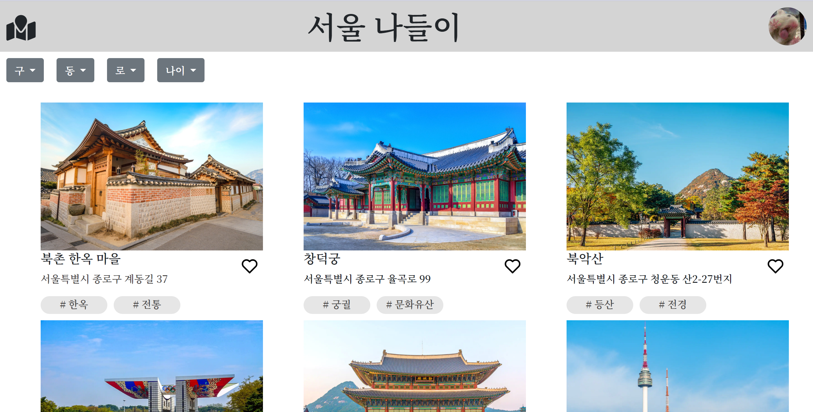
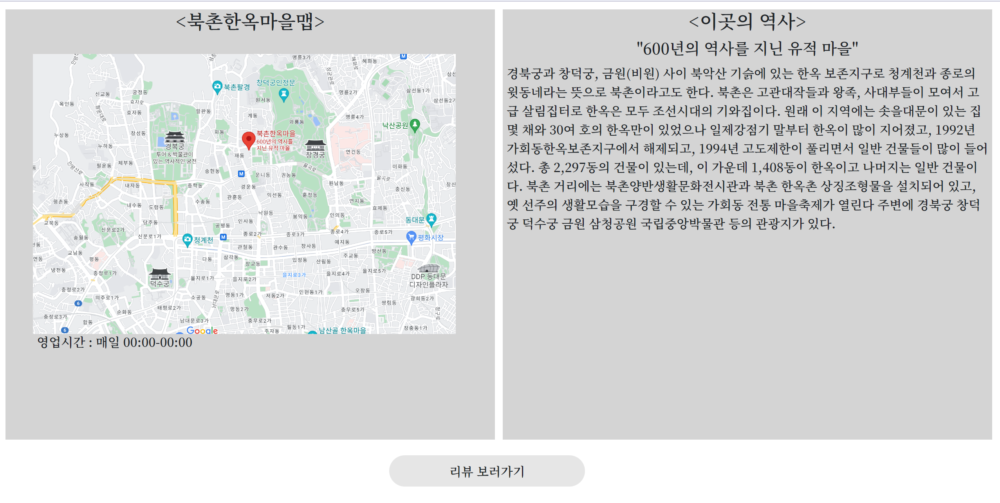
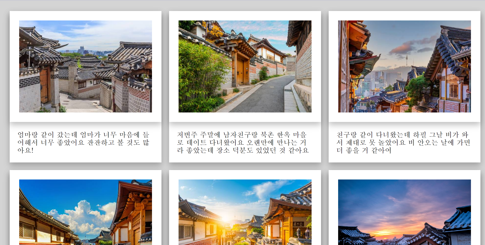

# 서울나들이
서울나들이는 서울에서 놀만한 장소를 추천하고, 그 장소의 소개와 다른 사용자가 남긴 리뷰를 볼 수 있는 웹사이트 입니다. 
[서울나들이](https://ch0515.github.io/WSM_Seoul/main.html)

사용방법
- 1. 사용자가 마음에드는 장소를 발견한다
- 2. 태그와 하트를 누른다
- 3. 마음에 드는 장소 이미지를 클릭한다
- 4. 해당 장소의 정보를 보고 다른 사용자들이 해당 장소를 다녀 온 뒤에 남긴 리뷰를 보고 싶으면 리뷰 보기 버튼을 클릭한다.

서울나들이 메인 페이지

서울나들이 장소 정보 페이지

서울나들이 리뷰 페이지

